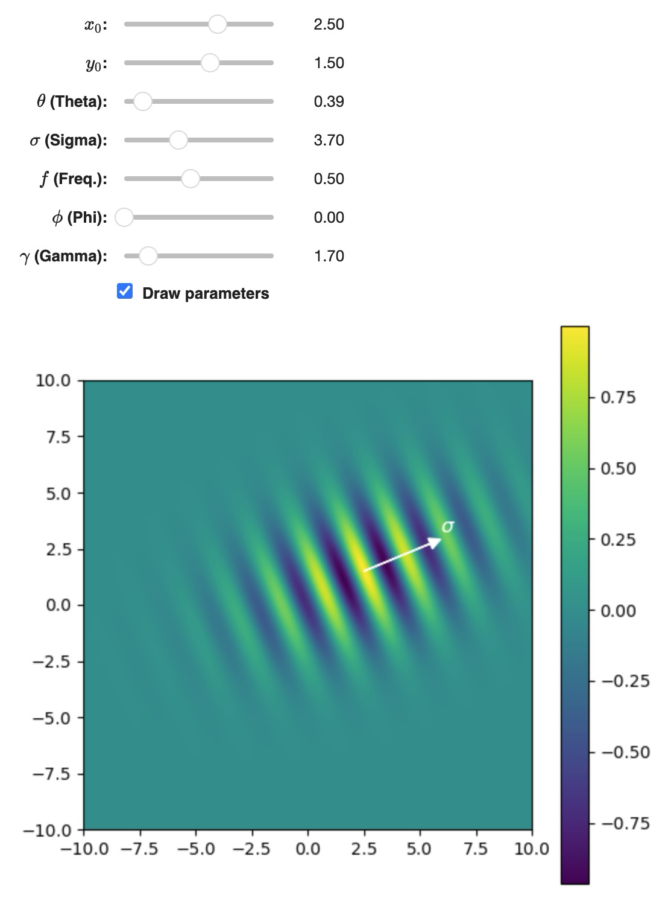

# ML Visualizations

Interactive visualizations of machine learning concepts

## Gabor functions

Gabor functions have been shown to be good models for the behavior of simple cells of V1, the first layer of visual perception in the brain. Also, many machine learning models including Deep Learning models like CNNs and Transformers learn gabor functions in their first layer when applied to natural images.

[This notebook](./notebooks/gabor-functions.ipynb) lets you interactively change the functions parameters to quickly get an intuitive feel for them.

