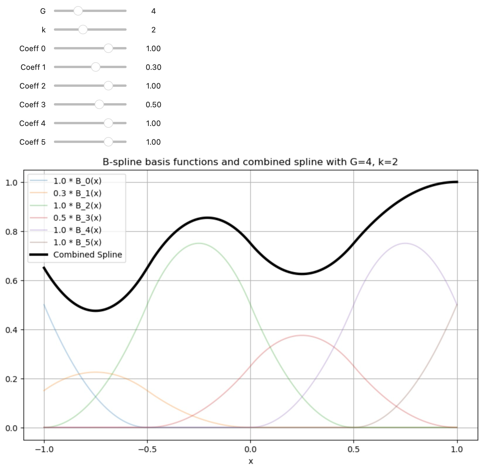
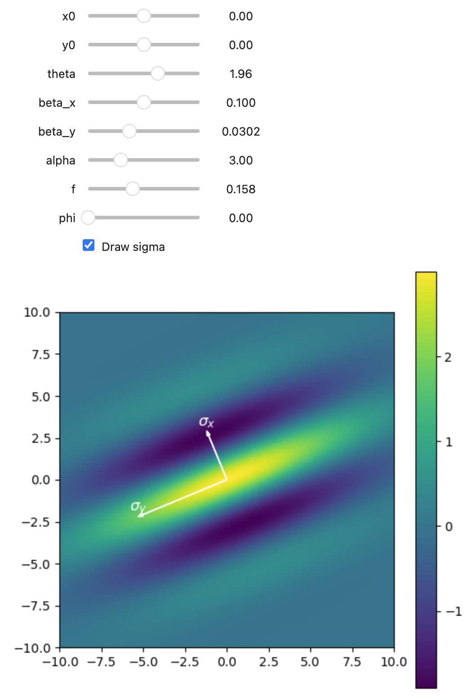
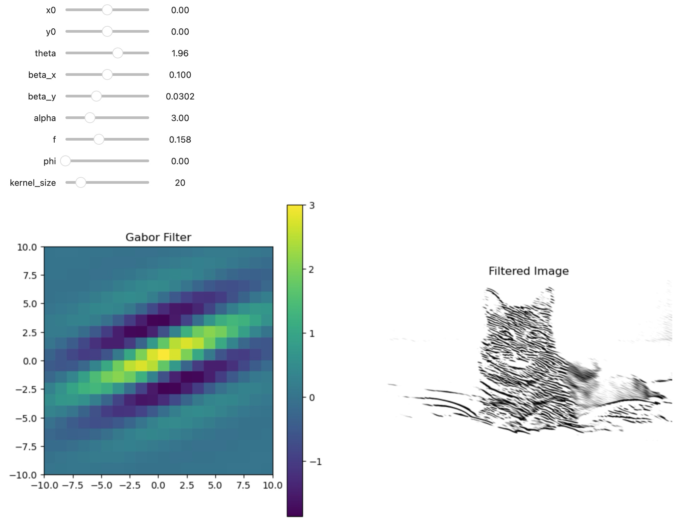

# ML Visualizations

Interactive visualizations of machine learning concepts

## B-Splines

B-Splines are the fundamental building blocks of [KANs (Kolmogorov-Arnold Networks)](https://arxiv.org/abs/2404.19756). Use the [B-Spline notebook](./notebooks/b-splines.ipynb) to get a feel for how basis splines combine to a B-spline, and how changing their parameters changes both the basis functions and the overall curve. 

## Gabor functions

Gabor functions have been shown to be good models for the behavior of simple cells of V1, the first layer of visual perception in the brain. Also, many machine learning models including Deep Learning models like CNNs and Transformers learn gabor functions in their first layer when applied to natural images.

[This notebook](./notebooks/gabor-functions.ipynb) lets you interactively change the functions parameters to quickly get an intuitive feel for them.

## Gabor convolution

Convolutional Neural Networks convolve their learned kernels over images (and hidden layer activations). Try it out with the [Gabor convolution notebook](./notebooks/gabor-convolution.ipynb).

